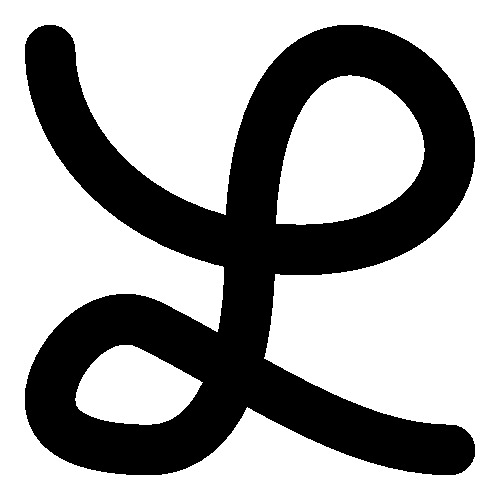
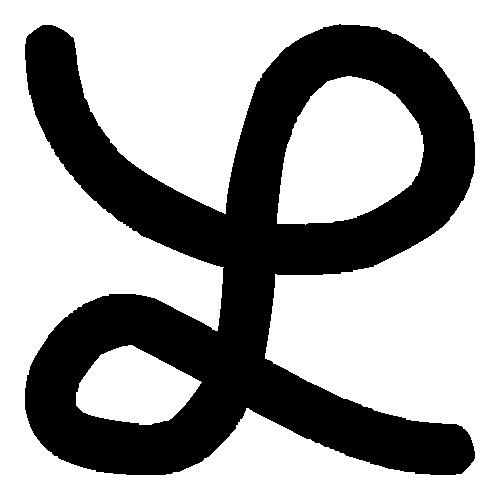
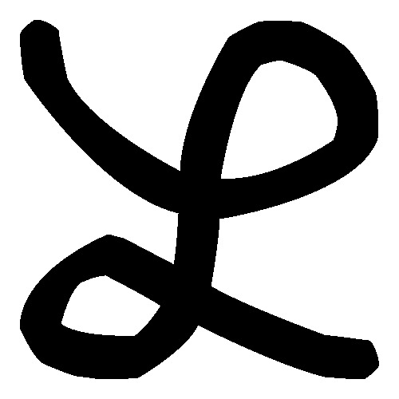
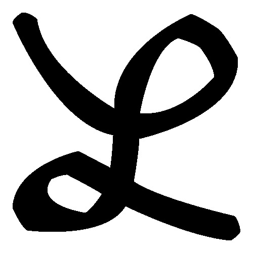
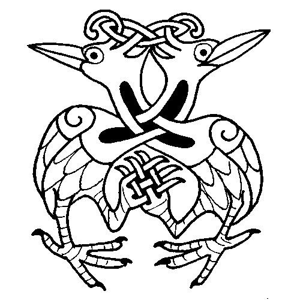
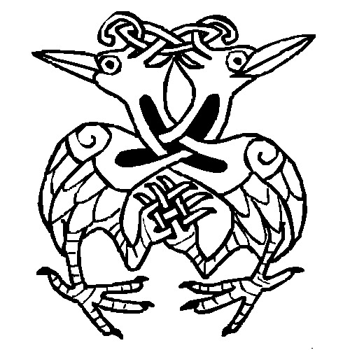
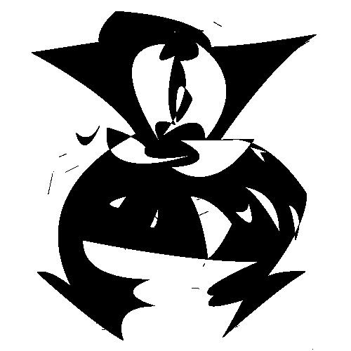

# MAP401 Projet logiciel
## Tâche 7, Partie 1
> Maël Perrier, Léo Grange

### `simplification.h`

Ajout de la fonction `douglas_peucker_b2`.

```diff
#ifndef SIMPLIFICATION_H
#define SIMPLIFICATION_H

#include "liste.h"

Liste * douglas_peucker(Liste * L, double d);
+ Liste * douglas_peucker_b2(Liste * L, double d);

#endif
```

### `eps.h`

Ajout de la fonction `generate_eps_init`.

```diff
#include <stdio.h>
#include "image.h"

+ void generate_eps_init(FILE * fd, Image I, bool fill);
void generate_eps(FILE * fd, Image I, bool fill, double d);

#endif
```

### `bezier.h`

```c
#ifndef BEZIER_H
#define BEZIER_H

#include "geom2d.h"
#include "liste.h"

typedef struct {
	Point C0;
	Point C1;
	Point C2;
} Bezier2;

typedef struct {
	Point C0;
	Point C1;
	Point C2;
	Point C3;
} Bezier3;

Point CalculBezier2(Bezier2 B, double t);
Point CalculBezier3(Bezier3 B, double t);

Bezier3 Bezier2to3(Bezier2 B);

Bezier2 approx_bezier2(Liste L);

double distance_point_bezier2(Bezier2 B, Point Pj, double ti);

void print_bezier2(Bezier2 B);
void print_bezier3(Bezier3 B);

#endif
```

***

### `test_bezier.c`

```c
#include "bezier.h"
#include "geom2d.h"
#include "liste.h"
#include <stdio.h>

int main(int argc, char * argv[]) {
	Point P0 = set_point(0, 0);
	Point P1 = set_point(1, 0);
	Point P2 = set_point(1, 1);
	Point P3 = set_point(1, 2);
	Point P4 = set_point(2, 2);
	Point P5 = set_point(3, 2);
	Point P6 = set_point(3, 3);
	Point P7 = set_point(4, 3);
	Point P8 = set_point(5, 3);

	Liste L = { NULL };
	ajouter_element_liste(&L, P0);
	ajouter_element_liste(&L, P1);

	printf("## Liste ##\n");
	imprimer_liste(L);

	printf("### N=1 ###\n");
	Bezier2 B1 = approx_bezier2(L);
	print_bezier2(B1);
	printf("\n");

	ajouter_element_liste(&L, P2);
	ajouter_element_liste(&L, P3);
	ajouter_element_liste(&L, P4);
	ajouter_element_liste(&L, P5);
	ajouter_element_liste(&L, P6);
	ajouter_element_liste(&L, P7);
	ajouter_element_liste(&L, P8);

	printf("## Liste ##\n");
	imprimer_liste(L);

	printf("### N≥2 ###\n");
	Bezier2 B2 = approx_bezier2(L);
	print_bezier2(B2);
	printf("\n");

	return 0;
}
```

***

### `Asterix3.pbm`

|Contours initiaux|D=1|D=3|D=10|D=30|
|-----------------|---|---|----|----|
|12959 segments|966 courbes|296 courbes|158 courbes|69 courbes|
||||||

### `lettre-L-cursive.pbm`

|Contours initiaux|D=1|D=3|D=10|D=30|
|-----------------|---|---|----|----|
|4232 segments|254 courbes|40 courbes|26 courbes|15 courbes|
||||||

### `ColombesDeLaPaix.pbm`

|Contours initiaux|D=1|D=3|D=10|D=30|
|-----------------|---|---|----|----|
|21871 segments|1599 courbes|587 courbes|295 courbes|148 courbes|
||||||
